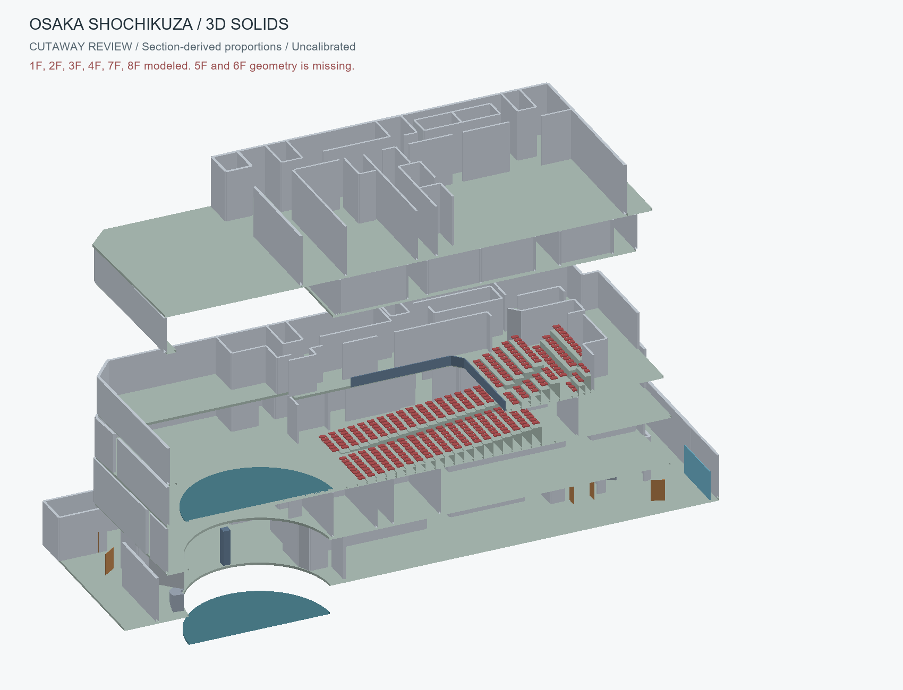
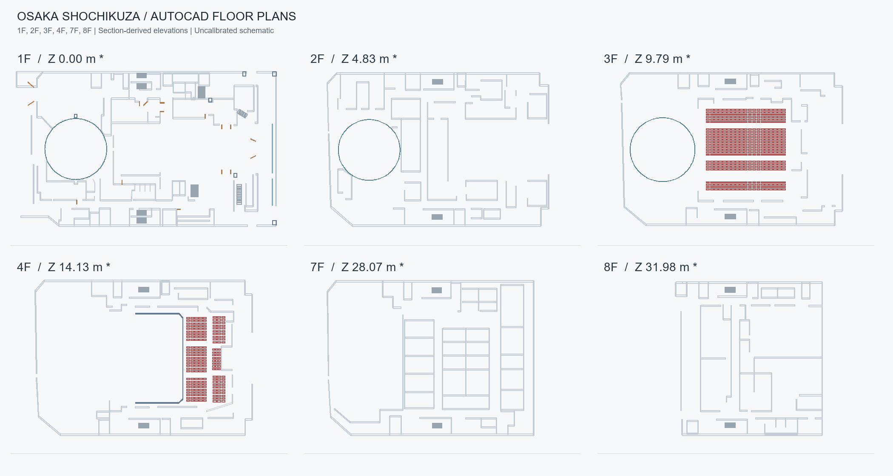

# 大阪松竹座 / AutoCADモデル

平面図と断面図の画像から作成した、編集可能な概略CADデータです。
1・2・3・4・7・8階を収録し、3Dモデルは1,643個の独立したソリッドに分かれています。

## ダウンロード

- **[AutoCAD用データ一式（ZIP）](downloads/shochikuza_autocad_package.zip?raw=true)**
- [3Dソリッドモデル（DXF）](data/shochikuza_3d_solids.dxf?raw=true)
- [全階の2D図面（DXF）](data/shochikuza_2d_all_floors.dxf?raw=true)
- [断面の参照図（DXF）](data/section_reference.dxf?raw=true)
- [詳しい説明・未確定事項](data/README_JA.md)

**初めての方は、下の「1. ZIPで受け取る」から進めてください。Gitやプログラミングの知識は不要です。**



## はじめに：ここは何をする場所？

このページは、図面やモデルを配布するための保管場所です。GitHubの画面上でAutoCADを操作するものではありません。ファイルを自分のパソコンに取り込み、AutoCADで開いて使います。

この手順はWindowsとAutoCADデスクトップ版を想定しています。AutoCADは別途インストール済みである必要があります。このデータをダウンロードしてもAutoCAD本体はインストールされません。

| 言葉 | この作業での意味 |
|---|---|
| GitHub（ギットハブ） | ファイルと更新履歴を置いておくWebサービス |
| リポジトリ | ひとまとまりの保管場所。このページの `autocad` がそれです |
| README（リードミー） | 最初に読む説明書。いま読んでいる文章です |
| ZIP（ジップ） | 複数のファイルをまとめたもの。「すべて展開」で中身を取り出します |
| DXF | AutoCADなどで開ける図面交換形式。今回は2D図面と3Dモデルをこの形式で配布しています |
| DWG | AutoCADで普段の作業を保存するときに使う図面形式 |
| Git（ギット） | ファイルの更新履歴を管理し、GitHubとやり取りする道具 |
| clone（クローン） | GitHubの保管場所を、履歴付きで自分のパソコンに複製する操作 |
| pull（プル） | cloneしたフォルダに、GitHub側の新しい更新を取り込む操作 |

**使い始める方法は2つあります。どちらか片方だけで大丈夫です。**

- 今回の図面を受け取って開きたい：**1. ZIPで受け取る**。Gitのインストールは不要です。
- 今後も更新版を取り込みたい：**3. cloneで受け取る**。最初にGitを準備します。

このリポジトリは公開されているため、ZIPのダウンロードやHTTPSでのcloneにGitHubアカウントは不要です。

## 1. ZIPで受け取る（初めての方におすすめ）

1. ページ上部の **「AutoCAD用データ一式（ZIP）」** をクリックします。
2. 通常はWindowsの「ダウンロード」フォルダに `shochikuza_autocad_package.zip` が入ります。ブラウザーのダウンロード一覧から「フォルダーに表示」を選んでも見つけられます。
3. ZIPファイルを右クリックして **「すべて展開」** を選びます。画面の「展開」を押してください。
4. 展開後のフォルダを開き、中の `shochikuza_autocad` フォルダに進みます。
5. `shochikuza_3d_solids.dxf` や `plan_01F.dxf` が見えれば、受け取り完了です。

ZIPをダブルクリックしただけでは、まだ圧縮された中身を見ている場合があります。AutoCADで使う前に「すべて展開」を済ませてください。

**GitHubの緑色の `Code` → `Download ZIP` でも受け取れます。** こちらはリポジトリ全体のZIPなので、展開後の `autocad-master` フォルダ内にある `data` を開きます。上の専用ZIPとはフォルダ名が違いますが、同じCADデータが入っています。

## 2. AutoCADで開いて、自分の作業用DWGにする

### 最初は1階の2D図面を開く

1. AutoCADを起動します。
2. 左上のアプリケーションメニューから「開く」→「図面」を選びます。`Ctrl` を押しながら `O` でも開けます。
3. ファイル選択画面の「ファイルの種類」を **DXF** に変更します。DWGだけを表示する設定だと、今回のファイルが一覧に出ません。
4. ZIPを展開したフォルダに移動して、**`plan_01F.dxf`** を選択します。cloneした方は `autocad` → `data` の中です。
5. 図面が表示されたら、マウスホイールを回すと拡大・縮小できます。ホイールを押し込んだままマウスを動かすと表示位置を移動できます。
6. 次に **`shochikuza_3d_solids.dxf`** を開くと、複数階の3Dモデルを確認できます。

### 開いたのに何も見えない場合

画面の表示範囲から図面が外れている可能性があります。

1. `Esc` を2回押し、実行途中の操作を終えます。
2. 画面下のコマンド入力欄に `_ZOOM` と入力して `Enter` を押します。
3. 続けて `_E` と入力して `Enter` を押します。図面全体が画面内に入ります。

コマンド入力欄が見えない場合は `Ctrl` + `9` で表示を切り替えられます。上の英数字はAutoCADの操作名で、プログラムを書く必要はありません。

### 3Dを立体として見る

真上から見ていると、3Dでも平面図のように見えます。

1. 画面右上のViewCube（「上」などが書かれた立方体）の角をクリックすると、斜めからの表示になります。
2. ViewCubeが見当たらない場合は、コマンド欄に `_VPOINT` → `Enter`、次に `1,-1,1` → `Enter` と入力します。
3. 線だけで内部まで透けて見える場合は、画面内の表示スタイルを「2Dワイヤーフレーム」から「コンセプト」などに変更します。表示名・位置はAutoCADのバージョンによって多少異なります。

### 見たい階だけ表示する

モデルは「画層」で階と部材を整理しています。画層は、表示・非表示をまとめて切り替えられる分類です。

| 画層の名前 | 意味 |
|---|---|
| `F01_` から始まる名前 | 1階の部材 |
| `F03_` から始まる名前 | 3階の部材 |
| `WALLS` | 壁 |
| `SLABS` | 床 |
| `STAIRS` | 階段 |
| `SEATING` | 客席 |
| `DOORS` / `GLAZING` | 扉 / ガラス部分 |

1. コマンド欄に `_LAYER` と入力して `Enter` を押し、「画層プロパティ管理」を開きます。
2. 例えば3階を見たい場合は、`F03_` から始まる画層を表示したままにして、ほかの階の画層の電球をクリックして消します。
3. 確認が終わったら、消した電球を再度クリックすると元に戻せます。これは表示を隠す操作で、部材の削除ではありません。

2Dを1階ずつ使うだけなら、画層を操作せず `plan_03F.dxf` など各階単独のファイルを開く方が簡単です。

### 自分の作業ファイルとして保存する

1. 「名前を付けて保存」を選択します。
2. ファイル形式でAutoCAD図面 **DWG** を選びます。
3. 「ドキュメント」などに自分用の作業フォルダを用意し、例えば `松竹座_検討用_01.dwg` として保存します。
4. 以後はそのDWGを開いて作業します。受け取ったDXFは原本として残しておくと比較できます。

cloneを使った場合も、**作業用DWGは `autocad` フォルダの外に保存する**と、更新を受け取るデータと自分の編集が混ざらずに済みます。パソコンで保存しただけで、GitHubへ自動送信されることはありません。

## 3. cloneで受け取る（更新版も取り込みたい方）

cloneは初回に1回だけ行います。手元に `autocad` フォルダができ、その中に図面と説明書が入ります。AutoCAD本体を複製する操作ではありません。

### 3-1. Gitをインストールする

1. [Git for Windowsの公式ダウンロードページ](https://git-scm.com/downloads/win) を開きます。
2. 自分のWindows用インストーラーをダウンロードして起動し、画面の案内に沿ってインストールします。選択に迷う設定は初期値のままで構いません。会社のPCでインストールが制限されている場合は、ZIPの方法を利用するか社内の管理担当者に相談してください。
3. Windowsのスタートメニューで「PowerShell」と検索して起動します。これは、文字でパソコンに操作を指示する画面です。
4. 以下の1行を入力し、`Enter` を押します。

```powershell
git --version
```

`git version ...` とバージョン番号が出れば準備完了です。「gitが認識されない」と表示されたら、PowerShellをいったん閉じて開き直し、もう一度試してください。

### 3-2. 保存場所を用意してcloneする

次の4行を上から1行ずつPowerShellに入力して、各行で `Enter` を押します。各行の入力後にエラーが出た場合は、先に下の「困ったとき」を確認してください。

```powershell
Set-Location $env:USERPROFILE
New-Item -ItemType Directory -Path CAD-Practice -Force
Set-Location .\CAD-Practice
git clone https://github.com/rikuter67/autocad.git
```

| 行 | 何をしているか |
|---|---|
| 1行目 | 自分のWindowsユーザーフォルダに移動します。`$env:USERPROFILE` はその場所を自動で表す名前なので、書き換え不要です |
| 2行目 | `CAD-Practice` という保存用フォルダを用意します |
| 3行目 | そのフォルダの中に移動します |
| 4行目 | GitHubからデータを取り込み、`autocad` フォルダを作ります |

文字が流れた後に、再び文字を入力できる状態に戻り、エラーが出ていなければ完了です。次の1行で図面のフォルダをエクスプローラーに表示できます。

```powershell
explorer .\autocad\data
```

中に `plan_01F.dxf` などがあれば成功です。**上の「2. AutoCADで開く」に進んでください。** GitHub上のページを開いたままにしておく必要はありません。

### 3-3. 後日、新しい版を受け取る

更新のお知らせがあったときに実行します。毎回cloneし直す必要はありません。

1. AutoCADで作業中の図面を保存し、取り込み元のDXFを閉じます。
2. PowerShellを開きます。
3. 次の2行を順番に入力します。

```powershell
Set-Location "$env:USERPROFILE\CAD-Practice\autocad"
git pull --ff-only
```

`Already up to date.` と表示されたら、すでに最新です。更新が取り込まれた場合は、`data` 内の新しいDXFを開いて確認します。**自分で別に保存したDWGへ変更が自動反映されるわけではありません。**

`--ff-only` は、複雑な履歴の統合が必要なときに勝手に進めず停止する指定です。エラーが出た場合はファイルを消さず、下の表を確認してください。

ZIPで受け取った方は `git pull` を使いません。新しいZIPをダウンロードし、前の版とは別のフォルダに展開します。

## 4. 困ったとき

| 状況・表示 | 対処 |
|---|---|
| GitHubに「大きすぎて表示できない」と出る | Web上のプレビュー制限です。上のダウンロードリンクかZIPで受け取って、AutoCADで開きます |
| DXFをダブルクリックしてもAutoCADが起動しない | ファイルの関連付けがない可能性があります。AutoCADを先に起動して「開く」から選択します |
| AutoCADの一覧にDXFが出ない | ファイル選択画面の「ファイルの種類」をDXFに変更します。ZIPも展開済みか確認してください |
| 開いたが図面が見えない | `_ZOOM` → `Enter` → `_E` → `Enter` で全体表示にします |
| 部屋名の日本語が表示されない | 日本語フォントの置き換えが必要な可能性があります。図面はMS Gothicを指定しています。文字スタイルを利用できる日本語フォントへ変更してください |
| 大きさが実物と違う | このモデルは実寸未校正です。下の「モデルの精度」を参照してください |
| `git` が認識されない | Gitのインストール後にPowerShellを開き直します。解決しない場合はZIPで受け取れます |
| `destination path 'autocad' already exists` | 同じ場所にフォルダがあります。以前clone済みなら更新手順へ進みます。ZIPで展開したフォルダや別の作業データなら削除せず、別の保存場所でcloneしてください |
| `not a git repository` | Git管理フォルダの外にいます。更新手順の `Set-Location` を実行します。ZIPから受け取ったフォルダではpullできません |
| pullで「local changes」や「overwritten」と出る | 受け取ったファイルを手元で変更した可能性があります。変更したファイルを別フォルダに退避し、状況を管理者に相談してください。強制上書きのコマンドは実行しないでください |
| GitHubの更新後も自分のDWGが変わらない | 別名保存したDWGは独立した作業ファイルです。新しいDXFを別に開いて比較します |
| cloneやpullで接続エラーになる | ネット接続とURLを確認します。会社のネットワーク制限も考えられます。ブラウザーでこのページが開けるか確認してください |

## 5. 編集した図面を誰かに渡すには

通常の図面共有なら、自分の作業用DWGを相手へ渡すだけで大丈夫です。Gitを使う必要はありません。

GitHubに変更を戻す操作は「push」と呼びます。閲覧・ダウンロードとは別で、書き込み権限が必要です。cloneしただけで書き込み権限が付くわけではありません。変更した図面もここで管理したい場合は、先にリポジトリ管理者とファイル名や更新方法を合わせてください。

## 収録内容

| ファイル | 内容 |
|---|---|
| `data/shochikuza_3d_solids.dxf` | ACISの3DSOLIDを含む3Dモデル |
| `data/shochikuza_3d_mesh_fallback.dxf` | 代替のポリフェイスメッシュ版 |
| `data/shochikuza_2d_all_floors.dxf` | 全6フロアを一覧配置した2D図面 |
| `data/plan_*F.dxf` | 各階単独の編集用2D図面 |
| `data/reference_*F.dxf` | 原画像の線をベクトル化した照合用図面 |
| `data/section_reference.dxf` | 断面画像の線と暫定床レベル |
| `data/model_parameters.json` | 座標変換、暫定スケール、階高などの設定 |
| `data/validation.json` | DXF構造と3D形状の検証結果 |
| `data/references/` | 入力の平面図・断面図画像 |



## モデルの精度

**実寸未校正の概略モデルです。** 基準幅を60mと仮定し、断面図の比率から高さ関係を推定しています。壁厚、階段、客席の傾斜・席数、細かな開口などに仮定・省略があります。正確な設計データとして扱う前に、既知寸法での校正と原図との照合が必要です。

5・6階は平面図が未提供のためモデル化していません。地下階・屋根構造等も含まない部分モデルです。上の3D画像は内部確認のため手前半分を表示上で切断しています。

形式はR2010 DXF、単位はmmです。全DXFの再読み込みと構造監査でエラー0件、1,643個のソリッドのACIS再解析と閉鎖形状の復元を確認しました。AutoCAD実機での動作確認とDWG変換は未実施です。

## 公式の参考資料

- [GitHub公式：リポジトリをクローンする](https://docs.github.com/ja/repositories/creating-and-managing-repositories/cloning-a-repository)
- [Git for Windowsの入手先](https://git-scm.com/downloads/win)
- [Autodesk公式：DXFの読み込み・書き出し](https://help.autodesk.com/cloudhelp/2023/ENU/AutoCAD-LT/files/GUID-11AEFE3C-D05A-45C3-8604-7B6A594440F3.htm)
